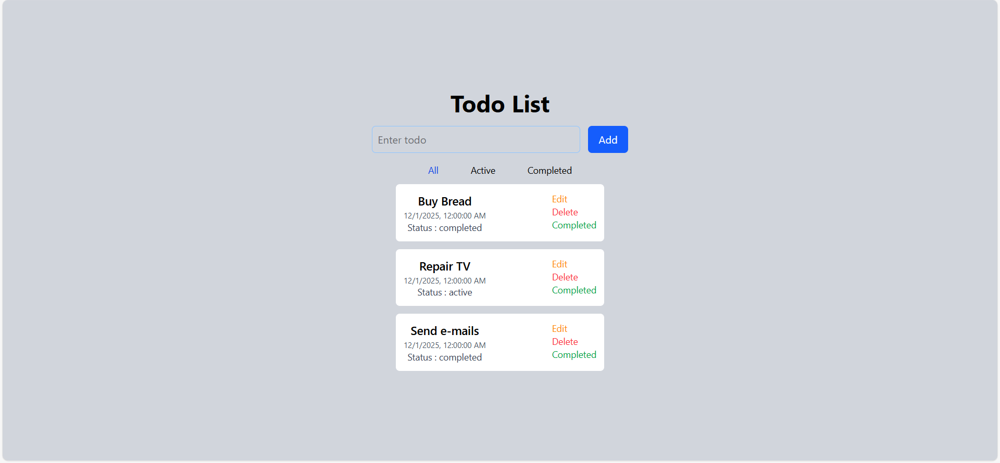
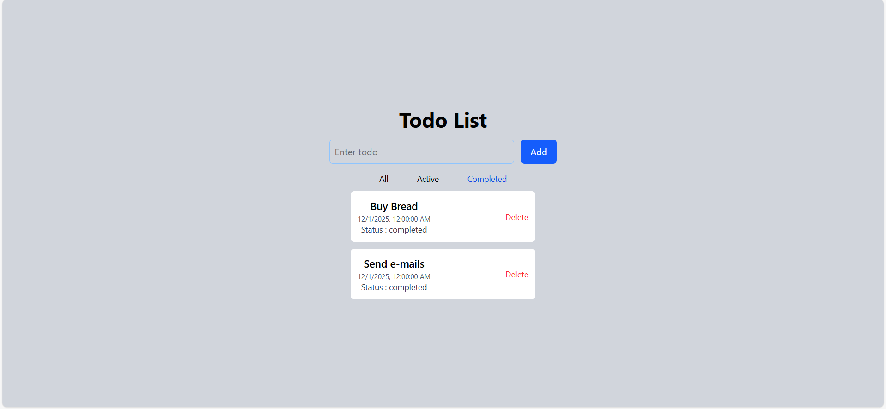
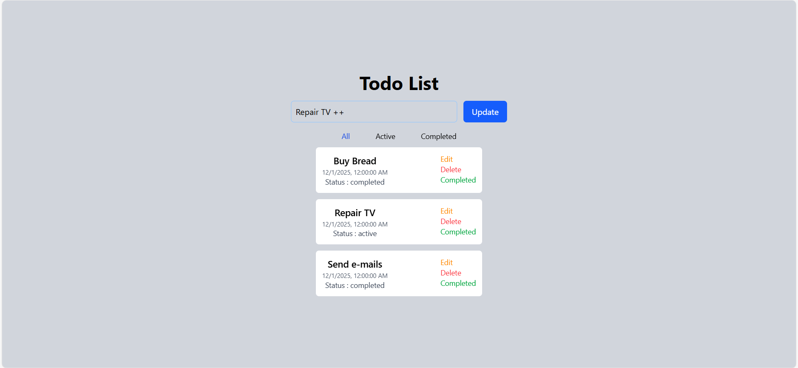

<div align="center">
  <h1="center">PERN Stack todo Web Application</h1>
</div>





### This project is a PERN stack To-Do application that I built for practice by following a You tube tutorials. The goal of the project was to strengthen my understanding of PostgreSQL, Express, React, and Node.js while learning how a full-stack application works end-to-end.

### The app allows users to create, edit, update, and delete tasks with a simple and clean interface. It includes essential backend functionality such as RESTful APIs and environment variables. On the frontend, the application provides a smooth user experience with React hooks and real-time UI updates. This project helped me improve my full-stack development skills and gain hands-on experience building a complete CRUD application with the PERN stack.

### Built with

- [![React][React.js]][React-url]
- [![Vite][Vite.js]][Vite-url]
- [![TailwindCss][TailwindCss]][Tailwind-url]
- [![Node][Node.js]][Node-url]
- [![Express][Express.js]][Express.js-url]
- [![PostgreSQL][PostgreSQL]][PostgreSQL-url]

## Getting started

### Prerequisites

- node.js: [Node.js download page](https://nodejs.org/en/download)
- postgreSQL: [postgreSQL download page](https://www.postgresql.org/download/)

### Installation

1. Clone the repo
   ```bash
   git clone https://github.com/Pasindu-himansa/pern-todo-web-app.git
   ```
2. Step into the project
   ```bash
   cd pern-todo-web-app
   ```

### Environment variables setup

#### Server side

1. Create a `.env` file in root folder
   ```
   New-Item -Path . -Name ".env" -ItemType "File"
   ```
2. Open the `.env` file and update the variables

   ```
   ## database configurations

   DB_HOST=<your database host>
   DB_USER=<database user>
   DB_PWD=<database password>
   DB_NAME=<your database name>
   ```

### Start the project using terminal

1. Install root NPM packages
   ```bash
   npm run install
   ```
2. Start the server
   ```bash
   npm run dev
   ```
3. Install client NPM packeges

   ```bash
   cd client
   ```

   ```bash
   npm run install
   ```

4. Run client
   ```bash
   npm run dev
   ```

## Contact

Email: [subasinghe.info@gmail.com](mailto:subasinghe.info@gmail.com) | LinkedIn: [Pasindu Subasinghe](https://www.linkedin.com/in/pasindu-subasinghe/)

<!-- MARKDOWN LINKS & IMAGES -->

[React.js]: https://img.shields.io/badge/React-20232A?style=for-the-badge&logo=react&logoColor=61DAFB
[React-url]: https://reactjs.org/
[Vite.js]: https://img.shields.io/badge/Vite-646CFF?style=for-the-badge&logo=vite&logoColor=white
[Vite-url]: https://vite.dev
[TailwindCss]: https://img.shields.io/badge/Tailwind_CSS-06B6D4?style=for-the-badge&logo=tailwind-css&logoColor=white
[Tailwind-url]: https://tailwindcss.com/
[Node.js]: https://img.shields.io/badge/Node.js-12A952?style=for-the-badge&logo=node.js&logoColor=white
[Node-url]: https://nodejs.org/en
[Express.js]: https://img.shields.io/badge/Express.js-000000?style=for-the-badge&logo=express&logoColor=white
[Express.js-url]: https://expressjs.com/
[PostgreSQL]: https://img.shields.io/badge/PostgreSQL-316192?style=for-the-badge&logo=postgresql&logoColor=white
[PostgreSQL-url]: https://www.postgresql.org/
